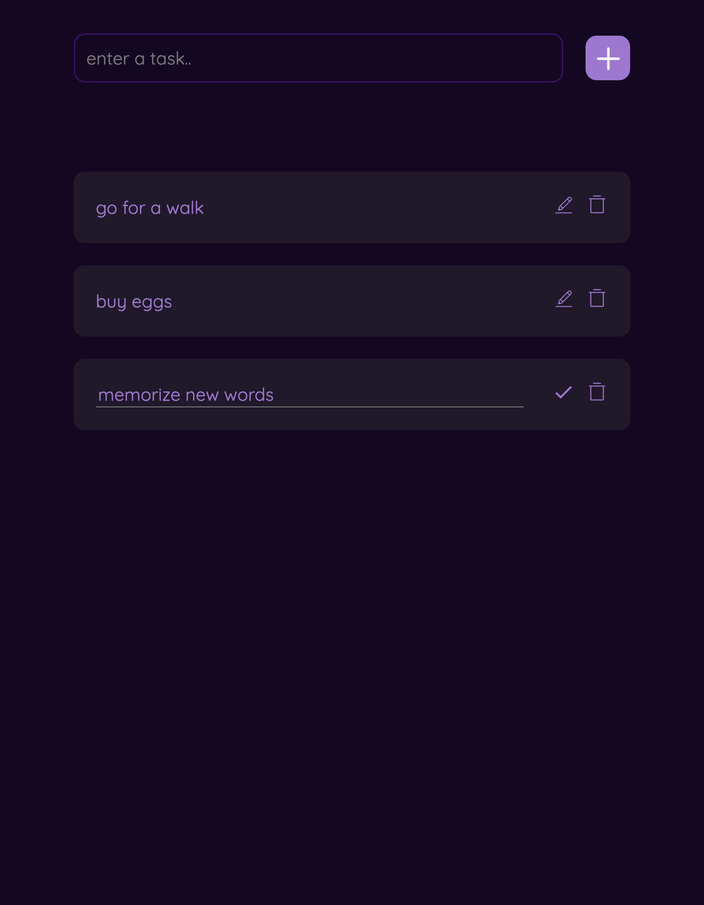

# Todo List App

This is a mini Todo List application created using React, Redux Toolkit, and TypeScript. You can add tasks, delete them, or edit them if you've made a spelling mistake. Once you've completed a task, you can click on it to mark it as done. This app makes it easier to manage your to-do items and stay organized

## Screenshots



## Tech Stack

Languages and tools used in this application;

- CSS
- React
- Vite
- Redux Toolkit
- React Icons
- Google Fonts

## Features

- Add new tasks
- Edit existing tasks
- Mark tasks as completed
- Delete tasks
- Mobile responsive design
- Clean and minimal layout
- Google fonts integration

## Installation

```bash
git clone https://github.com/Rumeysa-koseoglu/todo-list-app
cd todo-list-app
npm install
npm run dev
Then open your browser and go to:

http://localhost:5137

 Note: The port number may vary. Use the address that appears in the terminal after running npm run dev.
```

## What I Learned

- How to structure a React project
- Integrating Redux Toolkit for state management
- Writing meaningful Git commit messages using conventional commit rules
- Creating a responsive and clean user interface
